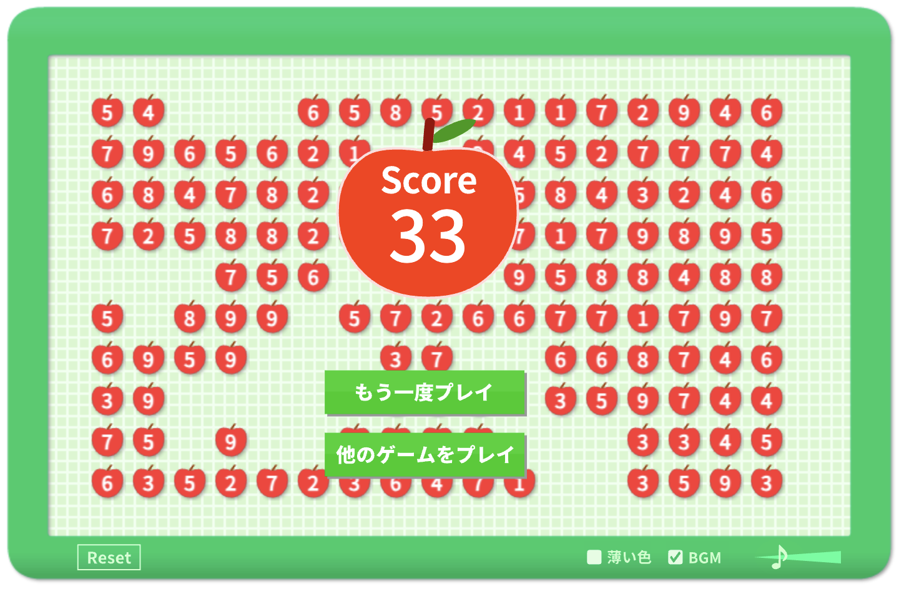

# Applegame
 사과게임을 풀 수 있는 알고리즘을 만들어 보려 한다.

# 게임요약
17x10 그리드에서 1~9로 표시된 사과들이 있다.
마우스를 끌어서 사과의 합이 총 10이 되겠금 둘러싸면 된다. 이때, 사과 하나당 1점씩 부여된다. 모든 사과를 없앨 경우에는 총 170점까지 이론상 가능하다.
그러나 현실에서는 170은 불가능한 경우도 많고 심지어 생각보다 어렵다.

물론, 연습을 많이 하면 실력이 늘어서 어느 정도 점수는 나오겠지만 실제로 몇점까지가 이론상 가능한지 시험해보기 위해 사과게임을 풀어주는 프로그램을 만들어보기로 했다.

`2023-11-24`  
오랜만에 들어와서 해봤더니 정말 실력이 형편없다.

# 비고
원래는 CPP로 하려다가 python으로 바꿨다.
